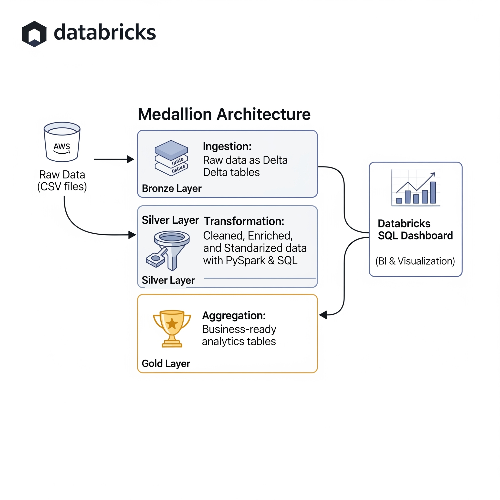
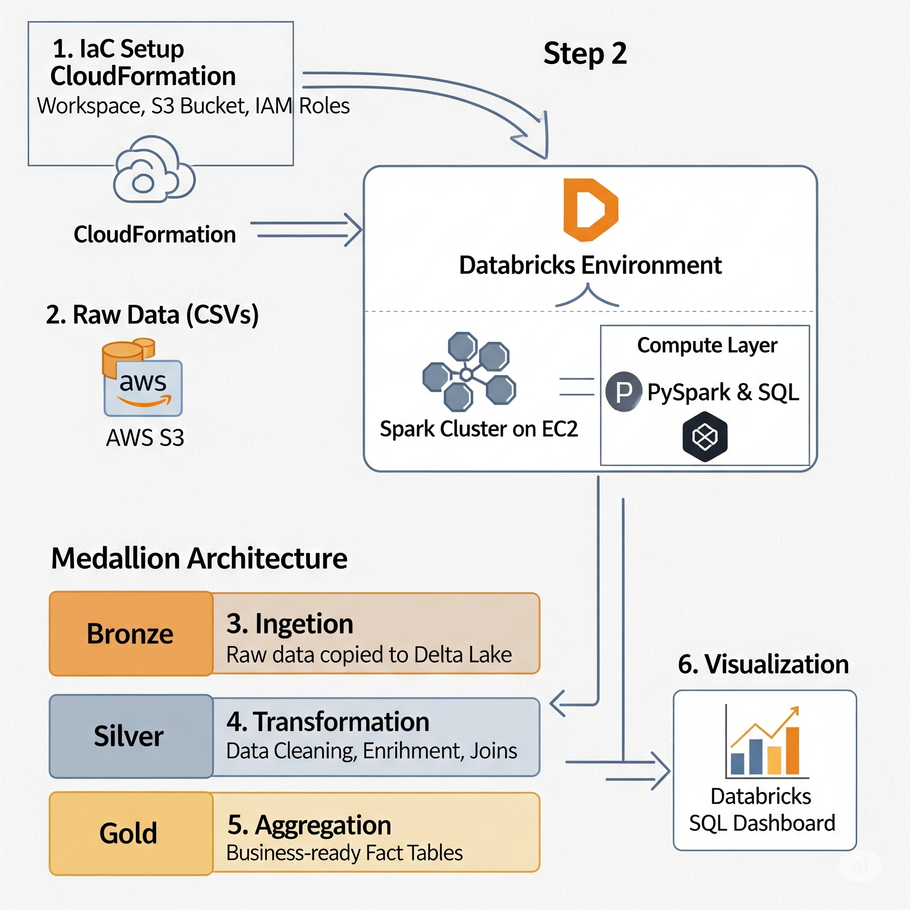
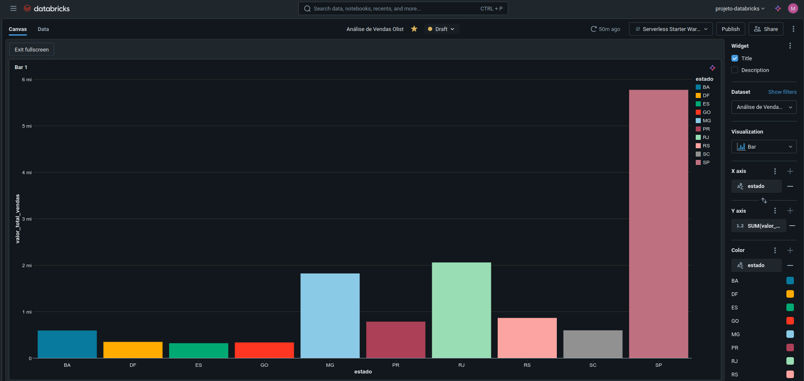

# Projeto de Pipeline de Dados com Databricks e AWS

**Status:** 🚀 Projeto Concluído!

## 1. Objetivo do Projeto

Este projeto demonstra a construção de um pipeline de dados de ponta a ponta, utilizando tecnologias de nuvem e ferramentas padrão de mercado. O objetivo foi simular um ambiente real de engenharia de dados, processando o dataset público de e-commerce da Olist (disponível no Kaggle) para extrair insights de negócio. O pipeline abrange desde a ingestão de dados brutos até a criação de um dashboard analítico.

## 2. Arquitetura do Pipeline

A arquitetura utilizada segue o padrão Medallion, com as camadas Bronze, Silver e Gold, garantindo governança, qualidade e performance.

### Arquitetura do Pipeline





```
[Dados Brutos em S3] --> [Databricks (Notebook 01)] --> [Camada Bronze] --> [Databricks (Notebook 02)] --> [Camada Silver] --> [Databricks (Notebook 03)] --> [Camada Gold] --> [Databricks SQL Dashboard]
```

## 3. Tecnologias Utilizadas

* **Nuvem:** AWS (S3 para o Data Lake, IAM para permissões, CloudFormation para provisionamento da infraestrutura)
* **Plataforma de Dados:** Databricks
* **Motor de Processamento:** Apache Spark
* **Formato das Tabelas:** Delta Lake
* **Linguagens:** Python (PySpark) e SQL
* **Orquestração:** Databricks Jobs (simulado pela execução manual dos notebooks em sequência)
* **Visualização de Dados:** Databricks SQL Dashboards
* **Controle de Versão:** Git & GitHub

## 4. Etapas do Pipeline

###  🥉 Camada Bronze (Dados Brutos)
- Os dados brutos (arquivos `.csv`) foram ingeridos do S3.
- Foram salvos como tabelas Delta na camada Bronze, mantendo seu estado original, servindo como uma fonte de verdade histórica e ponto de partida para o pipeline.

### 🥈 Camada Silver (Dados Limpos e Enriquecidos)
- Leitura dos dados da camada Bronze.
- **Limpeza e Padronização:** Conversão de tipos de dados (ex: strings para timestamp, strings para números decimais), tratamento de valores nulos e padronização de nomes de colunas.
- **Enriquecimento:** Realização de um `join` entre a tabela de produtos e a de tradução para incluir os nomes das categorias em inglês.

### 🥇 Camada Gold (Dados Agregados para Negócio)
- Leitura das tabelas limpas da camada Silver.
- **Modelagem de Negócio:** Criação de uma tabela de fatos (`gold_analytics_orders`) através de `joins` entre as tabelas `orders`, `order_items`, `products` e `customers`.
- **Criação de Métricas:** Adição de colunas calculadas, como `total_value` (preço + frete).
- O resultado é uma tabela denormalizada e otimizada, pronta para ser consumida por ferramentas de BI.

## 5. Resultado Final: Dashboard Analítico

A tabela Gold foi utilizada no Databricks SQL para criar um dashboard interativo respondendo à pergunta de negócio: "Quais são os 10 estados com maior volume de vendas?".

### Resultado Final: Dashboard



## 6. Como Executar

1.  Configurar as permissões no AWS IAM e o acesso do Databricks ao S3.
2.  Executar o notebook `01_ingestao_bronze.py` para criar a camada Bronze.
3.  Executar o notebook `02_silver_transformations.py` para criar a camada Silver.
4.  Executar o notebook `03_gold_analytics.py` para criar a camada Gold.
5.  Criar a consulta e o dashboard no ambiente Databricks SQL.

## 7. Autor

**Matheus G Monteiro**
* [LinkedIn](https://www.linkedin.com/in/gmonteiromatheus)
* [GitHub](https://github.com/monteurmatt)
